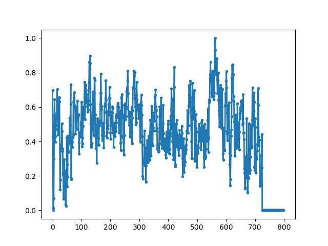
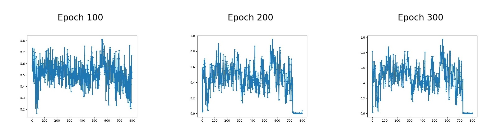

## Using Generative Adversarial Networks for Data Generation (WIP)

This project aims to synthesize realistic medical data to assist in classification research. Using GANs (Generative Adversarial Networks) to synthesize an abundant amount of medical data saves both time and resource when attempting to understand the subtle patterns of a particular population. With more data, one can be more confident when arriving at a conclusion. An example of a piece of real data gathered is shown below:

The architecture of the GAN model used in this project is inspired by the architecture introduced in this [paper](https://ieeexplore.ieee.org/document/9217447). As of currently, we only have one  piece of real-data to train with. For consistency sake, we trained the model with fixed (1, 100) sized noise for 300 epochs. Below are the results from the 100th, 200th, and the 300th epochs respectively.

As seen, after approximately 300 epochs, the generator has learned to mimic the precise features of the real sample. However, as there is only one training sample, the generator quickly overfitted. Nevertheless, the GAN model has shown promising results for learning and generalizing features of the input distribution.  

